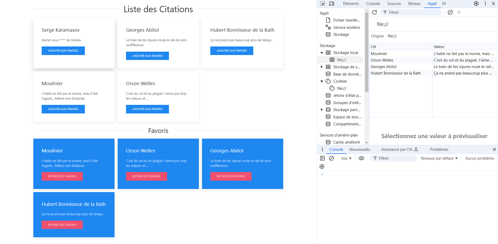

# Exercices JavaScript - Base

Bienvenue dans cette série d'exercices JavaScript pour renforcer vos compétences et découvrir des fonctionnalités intéressantes de ce langage. Vous trouverez ci-dessous les consignes pour chaque exercice ainsi que des explications claires pour comprendre leur objectif.

---

## I. Exercice 1 : Carré interactif

**Objectif** : Créer une page web avec un carré interactif.

### Instructions :
1. Affichez un carré de 200 x 200 pixels avec :
   - Une couleur de fond de votre choix.
   - Un texte centré à l'intérieur du carré.
2. Ajoutez un événement `onclick` pour déclencher une alerte affichant les informations suivantes :
   - La classe CSS du carré.
   - La couleur du texte et du fond.
   - La hauteur et la largeur.
   - La police et la taille du texte.

---

## II. Exercice 2 : Transfert de couleur

**Objectif** : Créer une interaction entre deux groupes de carrés colorés.

### Instructions :
1. Affichez 4 carrés de 200 x 200 pixels avec des couleurs de fond différentes.
2. Ajoutez une interaction :
   - Lorsque vous cliquez sur un carré du groupe du haut, le carré correspondant en bas prend sa couleur.
   - Affichez le code couleur du carré sélectionné.

---

## III. Exercice 3 : Carrés dynamiques

**Objectif** : Créer des animations sur des carrés interactifs.

### Instructions :
1. Affichez 4 carrés de 200 x 200 pixels avec un fond vert.
2. Numérotez chaque carré de 1 à 4 et disposez-les comme dans l'exemple fourni.
3. Ajoutez une interaction :
   - Lors d'un clic, le carré rétrécit de 10 %, effectue une rotation de 360°, et change son fond en rouge.
   - Lors d'un second clic, le carré revient à son état initial.

---

## IV. Exercice 4 : Arrière-plan dynamique

**Objectif** : Modifier le fond de la page et styliser des icônes.

### Instructions :
1. Créez une page avec un fond gris et 3 icônes représentant des réseaux sociaux.
2. Ajoutez une interaction :
   - Lorsqu'on clique sur une icône :
     - Le fond de la page prend la couleur associée.
     - Le nom du réseau social s'affiche.
     - Les bords de l'icône deviennent arrondis et une ombre apparaît.
   - Lors d'un second clic sur la même icône :
     - Le fond redevient gris.
     - L'icône revient à son état initial.

---

## V. Exercice 5 : Citations et favoris

**Objectif** : Manipuler un tableau associatif pour afficher et sauvegarder des citations.

### Instructions :
1. Créez un fichier `quotes.js` contenant un tableau associatif avec des citations.
2. Ajoutez un script JavaScript pour :
   - Parcourir et afficher les citations sur la page.
   - Implémenter un système de favoris permettant de marquer une citation.
3. **BONUS** :
   - Stockez les favoris dans le `localStorage` pour qu'ils soient conservés après rechargement de la page.

---

